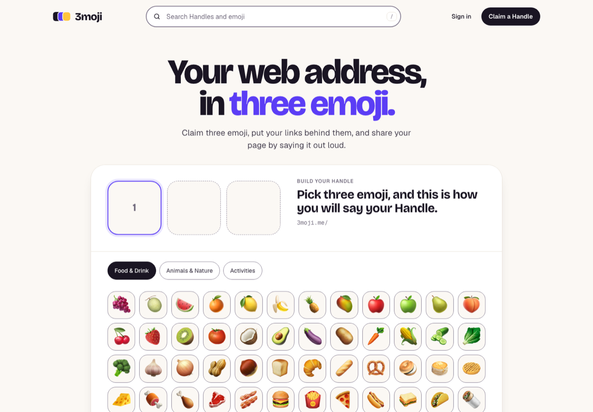
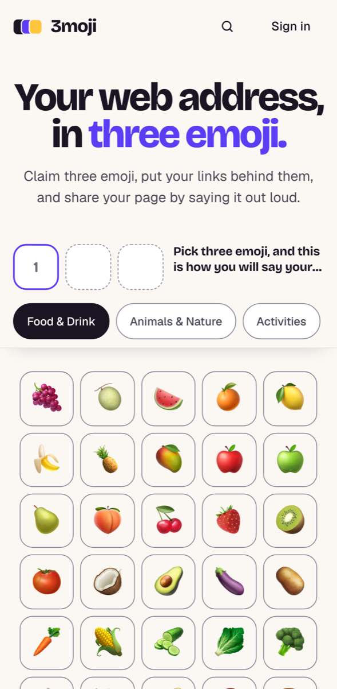
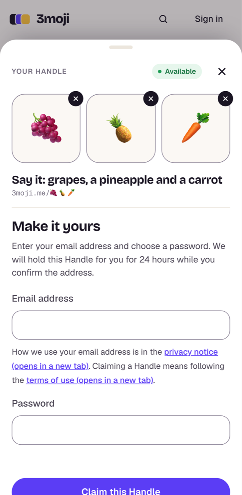

# 3moji

**Claim a handle you can say out loud.**

[**3moji.me**](https://3moji.me) turns three emoji into your web address. You claim three emoji, put your links behind them, and share the page by saying it: `3moji.me/🍇🍍🥕` is _"grapes, a pineapple and a carrot."_ Think Linktree meets what3words.

Every keyboard on earth has emoji, so anyone can type a three-emoji handle, remember it as a picture, and say it as a phrase.

<p align="center">
  
</p>

<p align="center">
  
  &nbsp;&nbsp;
  
</p>

> [!NOTE]
> **Status: MVP built and deployed, not yet announced.** The site is live at `3moji.me` and you can claim a Handle end to end. A few owner checks still stand between it and a public launch; see [What's left before launch](#whats-left-before-launch).

## Contents

- [The idea](#the-idea)
- [What's built](#whats-built)
- [How it's built](#how-its-built)
- [How it was made](#how-it-was-made)
- [What it cost to build](#what-it-cost-to-build)
- [What's left before launch](#whats-left-before-launch)
- [Working on the code](#working-on-the-code)
- [Licence](#licence)

## The idea

The code uses these words exactly, and [CONTEXT.md](CONTEXT.md) is the full glossary.

- An **Account** (email and password) claims one **Handle**.
- A Handle is an ordered sequence of emoji from a curated **Emoji Set**. Each emoji has one **Spoken Name**, so any Handle can be said aloud.
- A Handle resolves to a **Profile**: a display name, a bio and ordered **Links**.
- A **Claim** is final once the Account's email is verified. Until then the Handle sits on a 24-hour **Hold**.
- **Reserved Handles** can never be claimed. A **Release** gives a Handle back to the pool.

Every live Account owns exactly one Handle, so releasing your Handle and deleting your account are the same act. Only three-emoji Handles can be claimed at launch; one- and two-emoji Handles are reserved.

## What's built

The MVP was planned as eight phases in the [`3moji-mvp` workstream](docs/workstreams/3moji-mvp.md). Each phase became an epic issue with sub-issues.

| Area                   | What works today                                                                                                                                                                                                                                                                                                                                                 |
| ---------------------- | ---------------------------------------------------------------------------------------------------------------------------------------------------------------------------------------------------------------------------------------------------------------------------------------------------------------------------------------------------------------- |
| **Claiming a Handle**  | <ul><li>A Handle builder: three slots and a tabbed emoji grid.</li><li>On desktop it's one connected card; on phones it's a pinned bar that opens a claim sheet.</li><li>You hear how the Handle is said as you pick.</li><li>It works without JavaScript.</li><li>A claim holds the Handle for 24 hours and becomes final when you verify your email.</li></ul> |
| **The Emoji Set**      | <ul><li>Pinned to Emoji 12.0 so emoji render on iOS 13.2+ and Android 10+.</li><li>Released in category drops, starting with Food & Drink, Animals & Nature and Activities.</li><li>Each emoji has one curated Spoken Name.</li></ul>                                                                                                                            |
| **Addresses**          | <ul><li>Emoji URLs are canonicalised: other spellings get a 308 redirect, and anything that isn't a Handle gets a 404.</li><li>A Handle can also be reached by its word alias.</li><li>An ambiguous alias that nobody has claimed lists the Handles you could claim.</li></ul>                                                                                   |
| **Profiles**           | <ul><li>Owners edit a display name, bio and ordered links.</li><li>Profiles get share images and link previews that hold up in bios and chat apps.</li></ul>                                                                                                                                                                                                     |
| **Accounts**           | <ul><li>Email and password sign-up with verification.</li><li>Sign in and password reset.</li><li>Releasing a Handle leaves a tombstone, and releasing deletes the account.</li></ul>                                                                                                                                                                            |
| **Search**             | <ul><li>A header search finds claimed Handles, with display names, and emoji by name.</li><li>Results are capped and rate-limited.</li></ul>                                                                                                                                                                                                                     |
| **Safety and the law** | <ul><li>A privacy notice and terms of use.</li><li>A way to report a Profile, plus a takedown runbook.</li><li>Rate limits on claiming, sign-in, password reset and search.</li><li>A nonce-based Content Security Policy and HSTS.</li><li>Analytics that redact tokens and query strings.</li></ul>                                                            |
| **Operations**         | <ul><li>Every deploy runs database migrations, and each preview gets its own database branch.</li><li>A nightly backup workflow encrypts backups with age and stores them in R2.</li><li>A workflow cleans up preview database branches.</li><li>Four runbooks: site down, email not arriving, restore from backup, takedown.</li></ul>                          |

The brand is "playful premium": violet `#5B3DF5` on warm paper `#FBF8F4`, set in Bricolage Grotesque and Geist.

## How it's built

A Turborepo monorepo in TypeScript strict mode, with no `any`:

```
apps/web/        Next.js 16 (App Router): the whole app, UI, route handlers and server actions
packages/core/   the domain: entities, use cases, ports and adapters. Framework-free, enforced by lint
packages/shared/ shared types, validation and the i18n messages
docs/            reports, ADRs, architecture, workstreams, runbooks
scripts/         verify.sh, migrations and the GitHub Issues/Project helper
```

| Layer    | Choice                                                                                                                   |
| -------- | ------------------------------------------------------------------------------------------------------------------------ |
| App      | Next.js 16 on Vercel. Route handlers and server actions are thin adapters over `packages/core`                           |
| Styling  | Tailwind CSS v4, with brand tokens in `@theme`                                                                           |
| Data     | Drizzle ORM and node-postgres on Neon Postgres. Migrations are committed and run in the build                            |
| Auth     | Better Auth: email and password, with tables in our own Postgres. `emailVerified` is what makes a claim final            |
| Email    | Resend, sending from `mail.3moji.me`                                                                                     |
| Testing  | Jest unit tests (about 2,300 across core and web), 136 integration tests against real Postgres, and Playwright E2E specs |
| Delivery | GitHub Actions CI, a required ruleset, and auto-merge on green                                                           |

The architecture is written down in [`docs/architecture/`](docs/architecture/system-overview.md). The decisions behind it are twelve ADRs:

| ADR                                                                                                          | Decision                                                                         |
| ------------------------------------------------------------------------------------------------------------ | -------------------------------------------------------------------------------- |
| [0001](docs/adr/0001-record-architecture-decisions.md)                                                       | Record architecture decisions                                                    |
| [0002](docs/adr/0002-track-work-in-github-issues.md)                                                         | Track work in GitHub Issues                                                      |
| [0003](docs/adr/0003-auto-merge-pull-requests-on-green-ci.md)                                                | Auto-merge pull requests on green CI                                             |
| [0004](docs/adr/0004-the-handle-model.md)                                                                    | The Handle model: Hold, Claim, Reserved, Release                                 |
| [0005](docs/adr/0005-the-emoji-set.md)                                                                       | The Emoji Set, pinned to Emoji 12.0                                              |
| [0006](docs/adr/0006-nextjs-on-vercel-is-the-whole-application.md)                                           | Next.js on Vercel is the whole application                                       |
| [0007](docs/adr/0007-release-the-emoji-set-in-category-drops.md)                                             | Release the Emoji Set in category drops                                          |
| [0008](docs/adr/0008-handles-are-addressable-by-emoji-and-by-their-word-alias.md)                            | Handles are addressable by emoji and by their word alias                         |
| [0009](docs/adr/0009-release-leaves-a-tombstone-and-the-cooldown-is-dropped-for-the-mvp.md)                  | Release leaves a tombstone; the cooldown is dropped for the MVP                  |
| [0010](docs/adr/0010-use-one-postgres-driver-in-every-environment.md)                                        | Use one Postgres driver in every environment                                     |
| [0011](docs/adr/0011-canonical-word-aliases-name-one-handle-and-unclaimed-aliases-list-claimable-handles.md) | Canonical word aliases name one Handle; unclaimed aliases list claimable Handles |
| [0012](docs/adr/0012-header-search-lists-claimed-handles-with-display-names-capped-and-rate-limited.md)      | Header search lists claimed Handles with display names, capped and rate-limited  |

## How it was made

One developer built 3moji with [Claude Code](https://claude.com/claude-code), over about three days from 11 to 14 September 2026. The developer set direction, made the product and design calls, and did the account-side setup: Vercel, Neon, Resend and DNS. Agents wrote the code, tests and docs.

The workflow puts deterministic guardrails in place of line-by-line human review:

1. **Plan in git.** Research goes into [reports](docs/reports/README.md), decisions into [ADRs](docs/adr/), and phased plans into a [workstream](docs/workstreams/3moji-mvp.md). The developer accepts every ADR explicitly.
2. **Plan into issues.** Each phase becomes an epic with PR-sized sub-issues and testable acceptance criteria.
3. **Fan out.** An orchestrating session hands issues to sub-agents. Each works in its own git worktree, follows test-first development with an observed red run, and opens a PR.
4. **Review, then merge on green.** Every PR gets an AI pre-review on correctness, TypeScript, OWASP, WCAG AA, tests and docs sync. The orchestrator checks it and adds the `automerge` label, and a workflow merges once CI passes ([ADR-0003](docs/adr/0003-auto-merge-pull-requests-on-green-ci.md)).
5. **Guardrails at every layer.**
   - Pre-tool and pre-commit hooks.
   - `scripts/verify.sh`: format, lint, typecheck, unit and integration tests, build, workflow lint, ADR checks and agent-workflow parity.
   - CI that runs the same checks, plus E2E tests and dependency audits.

The agent contract is [AGENTS.md](AGENTS.md). Its rules came from real incidents in this repo, such as agents clobbering each other's scratch files and a flaky test tied to the real clock.

**By the numbers**, as of 14 September 2026:

| Measure                       | Count |
| ----------------------------- | ----- |
| Pull requests merged          | 138   |
| Issues closed                 | 120   |
| Architecture decision records | 12    |
| Research reports              | 4     |
| Runbooks                      | 4     |
| Claude Code sessions          | 7     |
| Sub-agents launched           | 149   |
| Model calls                   | 9,875 |

## What it cost to build

These are the tokens behind the whole project. The count runs from the first planning session, just after the template workflow was adopted in [#6](https://github.com/joshstothard/3moji/pull/6), up to this README. They come from the Claude Code session logs on the developer's machine, with each API response counted once.

| Model            | Calls     | Input   | Output    | Cache writes | Cache reads   | Cost at API prices |
| ---------------- | --------- | ------- | --------- | ------------ | ------------- | ------------------ |
| Claude Opus 5    | 9,638     | 172,086 | 2,990,272 | 59,257,632   | 2,414,885,796 | $1,682.34          |
| Claude Fable 5.1 | 224       | 5,978   | 79,901    | 1,641,679    | 21,307,102    | $32.39             |
| Claude Haiku 4.5 | 13        | 108     | 20        | 84,626       | 778,560       | $0.18              |
| **Total**        | **9,875** | 178,172 | 3,070,193 | 60,983,937   | 2,436,971,458 | **≈ $1,715**       |

That's about **2.5 billion tokens**. Over 97% of them are cache reads, where an agent re-reads its conversation so far. On Opus 5 that costs a tenth of the input price. The code, tests and docs themselves came to about 3 million output tokens.

> [!IMPORTANT]
> **This is not an invoice.** The project was built on a Claude subscription, not metered API billing. The dollar figure is what the same token usage would have cost at [Anthropic's published API prices](https://platform.claude.com/docs/en/about-claude/pricing), checked on 14 September 2026, with 5-minute and 1-hour cache writes priced separately. It counts Claude Code on the developer's machine only, which is where all of this project's work happened. It leaves out chats on claude.ai, and the hosting costs, which are nil on free tiers.

## What's left before launch

The build is done. What's left is mostly owner work that an agent can't or shouldn't do:

- **Emoji render check** ([#23](https://github.com/joshstothard/3moji/issues/23), then [#55](https://github.com/joshstothard/3moji/issues/55)). Compare the launch categories side by side on real iOS and Android devices, and drop any emoji that render differently.
- **Nightly backups** ([#262](https://github.com/joshstothard/3moji/issues/262)). Create the R2 bucket and encryption key, then switch the workflow on.
- **Uptime checks** ([#207](https://github.com/joshstothard/3moji/issues/207)). Set up external monitoring.
- **Handle 404 without JavaScript** ([#233](https://github.com/joshstothard/3moji/issues/233)). Render the not-found page on the server.
- **Legal and contact.** Review the draft privacy notice and terms, set the report contact address, and check the ICO fee and Ofcom duties.
- **Email and hosting.** Improve deliverability so verification emails stay out of junk, and move off Vercel Hobby, whose terms rule out commercial use, before announcing.

## Working on the code

Setup, commands and conventions live in the developer docs:

- [docs/development/local-setup.md](docs/development/local-setup.md): prerequisites, install, useful commands and coding agent setup
- [CONTRIBUTING.md](CONTRIBUTING.md): branches, commits, PRs, reports, ADRs and workstreams
- [AGENTS.md](AGENTS.md): the agent contract
- [docs/development/github-workflow.md](docs/development/github-workflow.md): issues, labels, epics and the project board
- [docs/philosophy.md](docs/philosophy.md): the engineering philosophy behind the workflow

## Licence

MIT.

The workflow, agent contract, skills and hooks come from [agentic-workflow-template](https://github.com/GavinGreenwood/agentic-workflow-template) by [Gavin Greenwood](https://github.com/GavinGreenwood). They're adapted here for a solo developer on GitHub Issues ([ADR-0002](docs/adr/0002-track-work-in-github-issues.md)). General improvements to the workflow itself are worth sending back upstream, and [ADOPT.md](ADOPT.md) explains how to bring it into another repo.
