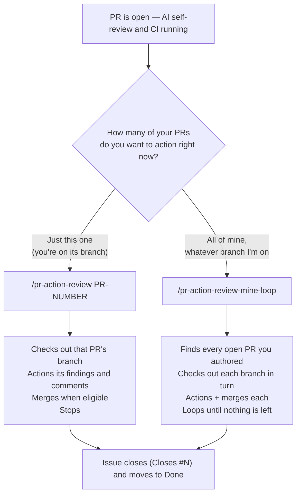
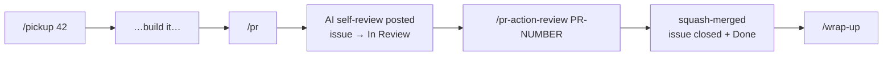
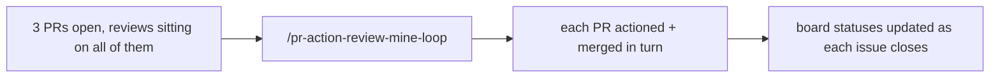

# Which PR review command do I run?

This is a solo repository, so every PR you action is one you raised. Review comes from the AI self-review that `pr` posts, from review bots such as Copilot code review, and occasionally from an outside contributor. The merge gate is the solo merge rule in [CONTRIBUTING.md](../../CONTRIBUTING.md#pull-requests): **CI green, and no unresolved 🔴 findings in the AI self-review.** GitHub does not let you approve your own PR, so no human approval is required.

One decision: **am I finishing the one PR I'm sitting on, or clearing everything I've got open?**

**Rule of thumb:** if you can name the PR number, use `pr-action-review`. The loop is a batch tool — it walks
_all_ your open PRs and will check out other branches to do it. Don't reach for it just because you happen to be
on a branch with one PR.

## The normal single-issue flow

1. `pr` verifies, pushes, opens the PR from the template with `Closes #42`, moves the issue to **In Review**, and posts the `## AI Review` comment against the 8 lenses.
2. `pr-action-review` triages every finding and comment — auto-fix, discuss, or informational — pushes the fixes, and squash-merges once CI is green and no 🔴 finding is unresolved. The issue closes and moves to **Done**.
3. `wrap-up` switches back to `main`, pulls, and deletes the finished branch.

Work that starts as a conversation goes through `capture` first; planned work arrives on the board from `plan-work`.

`/pr --watch` collapses steps 1 and 2: it opens the PR, waits for the first review to land, then runs
`pr-action-review` for you automatically. Same thing, one less command. Without `--watch`, `/pr` _offers_ to
watch and you say yes — the flag just skips the question.

## The batch flow

Use `pr-action-review-mine-loop` when you've stacked up several PRs and want them all landed — typically first thing
in the morning, after bot reviews have arrived overnight, or at the end of a `plan-work` phase when each sub-issue
has its own PR. Stacked chains are handled too: a stacked PR is retargeted to `main` once its parent merges, and
merged with a merge commit rather than a squash.

## Common misunderstandings

| Claim                             | Reality                                                                                                                                                                                         |
| --------------------------------- | ----------------------------------------------------------------------------------------------------------------------------------------------------------------------------------------------- |
| `/wrap-up` "merges everything in" | It does **not** merge anything. It switches to `main`, pulls, and deletes the finished feature branch. Merging happens in `pr-action-review` (or the loop). That's why the PR looked untouched. |
| Use the loop to watch one PR      | The loop isn't a watcher. For one PR use `/pr --watch`, or `/pr-action-review <number>` once a review is in.                                                                                    |
| I need to approve my PR to merge  | You can't — GitHub blocks self-approval. The AI self-review comment is the gate; merge when CI is green and its 🔴 findings are resolved or pushed back on.                                     |

## Cheat sheet

| I want to…                                    | Command                         |
| --------------------------------------------- | ------------------------------- |
| Action reviews on one specific PR             | `/pr-action-review <pr-number>` |
| Open a PR and have it self-drive to merge     | `/pr --watch`                   |
| Land every open PR I own                      | `/pr-action-review-mine-loop`   |
| Tidy up after a merge (branch + back to main) | `/wrap-up`                      |
